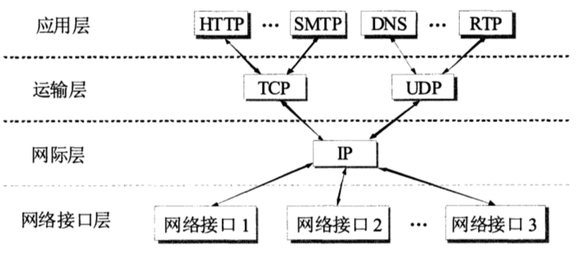
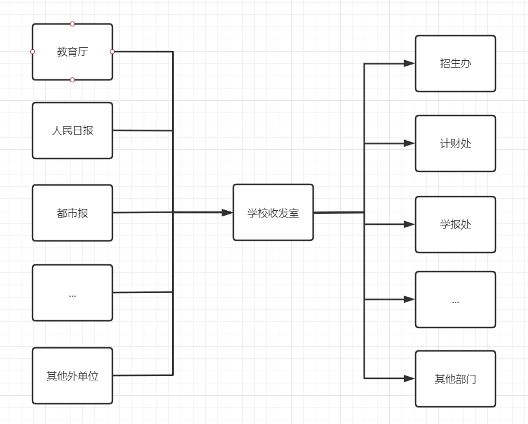

# TCP/IP

- everything over IP: TCP/IP协议可以为各式各样的应用提供服务
- IP over everything: 允许IP协议在各式各样的网络构成的互联网上运行

在TCP/IP运输层的有两个主要协议:
1. 用户数据报协议UDP(User Datagram Protocol)
2. 传输控制协议TCP(Transmission Control Protocol)

TCP在通信时传送的数据单位叫做TCP报文段(segment)
UDP在通信时传送的数据单位叫做UDP用户数据报

运输层的复用和分用:
- 复用: 应用层所有的应用进程都可以通过运输层再传送到IP层

- 分用: 运输层从IP层收到发送给各应用程序的数据后, 必须分别交付到指明的各应用程序。

**举个例子** 我们学校有一个收发室, 学校所有部门向外单位发送的公文交给收发室来进行寄送, 相当于学校的所有部分都在"复用"这个收发室. 当收发室收到外单位寄来的文件时, 则按照文件写明的部门地址进行正确交付, 则是完成了"分用"功能。

运输层提供了**进程**之间的**逻辑通信**, 在操作系统中, 运行一个应用程序, 就新建了一个进程. 在IP层(网络层)则是提供了主机之间的逻辑通信。

在TCP和UDP协议中的首部格式中都包含了**源端口**和**目的端口**两个字段, 因此当传输层收到IP层上交的运输层报文, 就能够根据目的端口号将数据传递给目的应用程序。

在Web应用程序中使用的[端口号](../../docs/TCP-IP/port.md)为80. 我们可以看见地址栏的URL上是没有显示端口号的, 因为80端口在浏览器上默认是不显示的（因为使用得太频繁了）, 你访问https://www.baidu.com, 相当于访问了https://www.baidu.com:80。