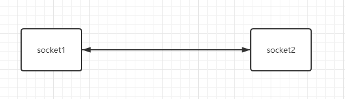
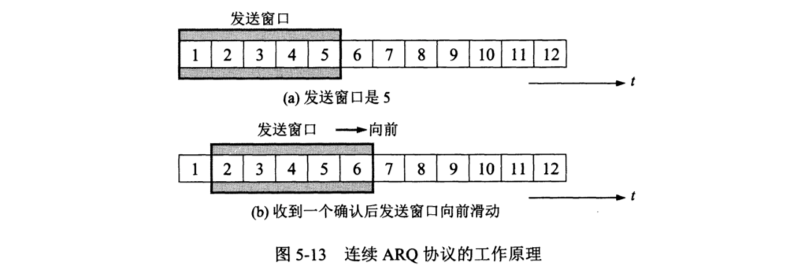
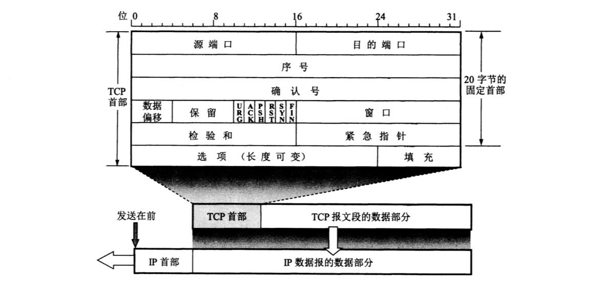

# 传输控制协议TCP

## 主要特点
1. **面向连接**， 我们在使用TCP协议之前， 必须建立TCP连接。数据传输之后， 就必须释放已经建立的TCP连接。事实上我们每次发送HTTP请求都是依赖于建立TCP连接。
2. 每一条TCP连接都是**点对点**的， 也就是一对一通信。
3. TCP是**可靠**的， 无差错、不丢失、不重复，按序达到。
4. TCP提供了**全双工通信**，也就是通信双方在任何时候都能发送数据。
5. TCP是**面向字节流**的。
   

## TCP的连接
在TCP中，连接是最基本的抽象，一条TCP连接的两个端点，我们称之为**socket（套接字）**。

socket的表示方法为点分十进制的IP地址加上端口号，并且用逗号或者冒号进行分隔。

## 停止等待协议
顾名思义，停止等待协议就是发送一个分组就等待确认，收到确认后就发送下一个分组。

停止等待协议是初期最简单的保证可靠传输的协议，理想情况是发送分组没有出现任何差错，当然这肯定过于理想化了。

#### *出现差错的情况*

可靠传输协议设计成只要发送方超过一段时间没有收到确认，就重传前面发送过的分组。发送方每发送一个分组就设置一个超时计时器，**到期之前**收到对方的确认，则撤销已设置的超时计时器。

既然可以重传前面发送过的分组，就说明之前**暂时保留了已发送的分组副本**，以便于进行超时重传。

要知道哪一个分组收到了确认，就需要对分组和确认分组进行**编号**，可以明确知道哪一个分组得到了确认。

超时计时器的重传时间**应当比数据在分组传输的平均往返时间更长一些**

#### *确认丢失和确认迟到*

第一种情况，发送方A向接收方B发送一条消息M1，B在发送确认收到消息M1的消息在中途丢失了，A在超时计时器到期之后，没有收到B发来的确认，就重新发送M1，A此时又需要重装M1，现在B收到了A重传的消息M1，就采取两个行动
1. 丢弃这个重复的分组M1，不向上进行交付，因为B知道自己收到了M1，而A没有收到B发送过去的确认消息。
2. 向A发送确认。

第二种情况，发送方A向接收方发送一条消息M1，B在发送确认消息M1的消息迟到了，A在超时计时器到期之后，还是没有B发来的确认，于是进行重新发送M1，然后B丢弃重复的分组，发送确认，那么A会收到两个确认，A会直接丢弃这个重复的确认消息。

使用这些机制，我们可以在不可靠的传输网络上实现可靠的通信。这种可靠传输协议被称为自动重传请求ARQ（Automatic Repeat Request），接收方不需要请求发送方重传某个出错的分组。

### 连续ARQ协议
**发送方**每收到一个确认，就把发送窗口向前滑动一个分组的位置。

**接收方**采用**累积确认**的方式，也就是收到几个分组之后，对**按序达到的最后一个分组发送确认**，以表示到这个分组为止的所有分组都已经正确收到了。这里一定是按序达到的最后一个分组，也就是如果中间分组在传输时丢失了，那么只确认前面按序达到的最后一个分组发送确认。假设有1、2、3、4、5个分组，如果3、4丢失了，那么发送确认收到2，而不是5。我们称之为**Go-Back-N**。

## 首部格式
我们在前面讲过TCP的数据单元是报文段。一个TCP报文段分为**首部**和**数据**两个部分，TCP的全部功能则体现在它首部中各字段的作用。

1. 源端口和目的端口，各占2个字节，TCP的分用也是通过端口实现的。
2. 序号，占4个字节，取值范围为[0,2^32-1]，序号增加到2^32-1之后，下一个序号就又回到0，也就是序号是**Mod 2^32运算**。在一个TCP连接中传送的字节流中的每一个字节都按顺序编号。在首部中序号字段的值是本报文段所发送的数据的**第一个字节**的序号
3. 确认号，占4个字节，期望收到对方**下一个报文段**的**第一个数据字节**的序号。
4. 数据偏移，占4位，指出TCP报文段首部的长度，计算单位是4个字节，也就是数据偏移的值乘以4个字节，最大值也就是15*4个字节也就是60个字节，这也是TCP首部的最大长度。
5. 保留，占6位，保留为今后使用，目前置位0
6. 控制位，占6位，每个位*置为1*表示**启用**该控制位，参考7-12
7. *紧急URG（URGent）*，启用时，TCP会将紧急数据插入到本报文段的最前面
8. *确认ACK（ACKownledgment）*，启用时，确认号生效。TCP规定在建立连接后的所有传送的报文段都必须将ACK置1。
9. *推送PSH（PuSH）*，启用时，告诉TCP尽快交付给接收应用程序，不用等到整个缓存填满后再向上交付。
10. *复位RST（ReSeT）*，启用时，表示TCP连接中出现严重差错，必须释放连接并且重现建立连接。
11. *同步SYN（SYNchronization）*，在连接建立时用来同步序号。
12. *终止FIN（FINis）*，用来释放一个连接。
13. 窗口，占2个字节，以字节为计算单位，这里的值指的是发送本报文段的一方的接收窗口。用来告诉对方，我的接收缓存空间还可以接收多少个字节的数据，指明了允许对方发送的数据量，并且窗口值是动态变化的。
14. 检验和，占用2个字节，需要加上12字节的伪首部

